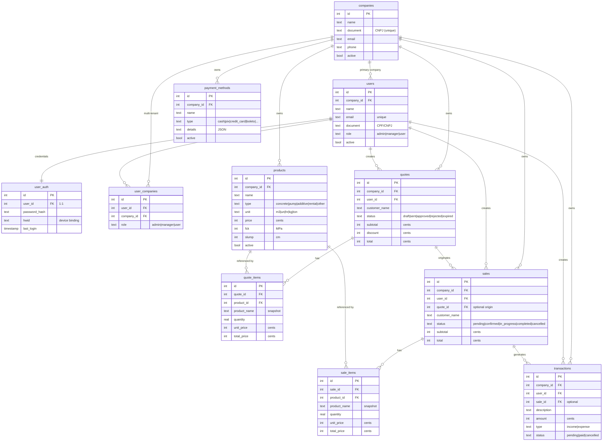
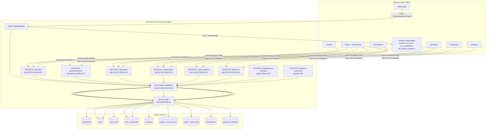
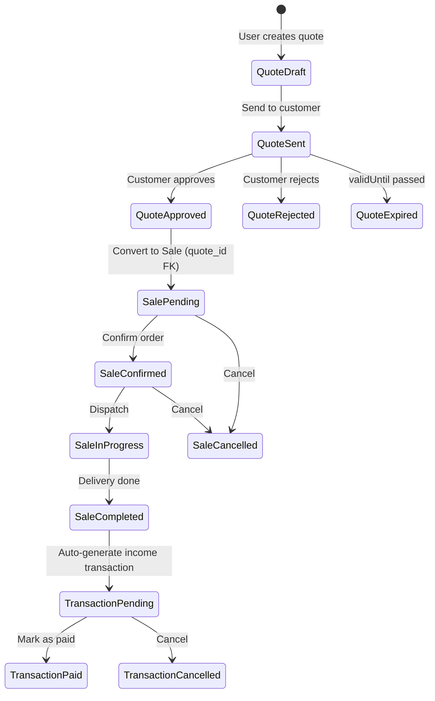
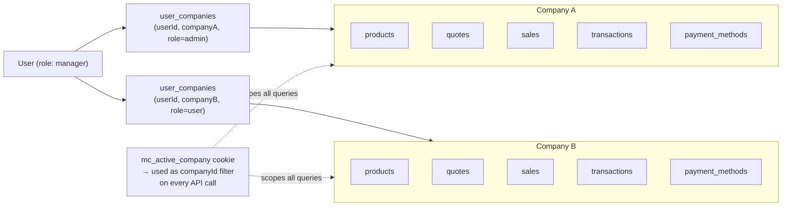

# Meu Concreto — Architecture Audit

> Generated: 2026-02-18

---

## Tech Stack

| Layer | Technology |
|---|---|
| Runtime | Bun 1.3 |
| Framework | Nuxt 4 (full-stack SSR) |
| UI | @nuxt/ui + Tailwind v4 |
| ORM | Drizzle ORM |
| DB | libsql (SQLite / Turso-compatible) |
| Validation | Zod |
| Auth | bcryptjs + cookie-based session |

---

## Database Schema (ER)

---

## Full Application Data Flow

---

## Business Lifecycle: Quote → Sale → Transaction

---

## Multi-Tenancy: User ↔ Company Access

---

## Key Architectural Observations

### ✅ Strengths

- **Clean separation**: All data access goes through `db.ts` → Drizzle → libsql. No raw SQL elsewhere.
- **Zod at the boundary**: Every write route validates through `server/utils/schemas.ts` before touching the DB.
- **Product snapshots**: `quote_items` and `sale_items` store a snapshot of `product_name`, `fck`, `slump`, etc. at time of creation — correct approach for audit integrity if a product is later edited/deleted.
- **HWID device binding**: On first login, the device fingerprint is recorded in `user_auth.hwid` and enforced on subsequent logins.
- **Multi-tenant ready**: The `user_companies` junction table lets one user belong to multiple companies with different roles per company.

### ⚠️ Potential Issues

| # | Area | Issue |
|---|---|---|
| 1 | **Authorization** | No auth middleware on API routes — `companyId` is taken from the request body/query, not verified against the authenticated user's session. A user could pass any `companyId` to access other companies' data. |
| 2 | **Session security** | Authentication state lives entirely in plain cookies (`mc_user`, `mc_companies`) without JWT signing or server-side session validation. |
| 3 | **Denormalized payment method** | `paymentMethod` on `sales` is a plain `text` field, not a FK to `payment_methods`. It can drift from defined methods. |
| 4 | **No test suite** | No Vitest/Playwright setup detected. All business logic is untested. |
